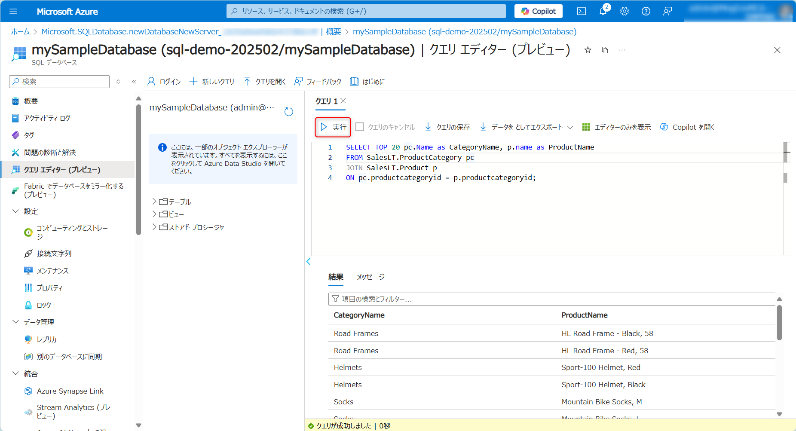
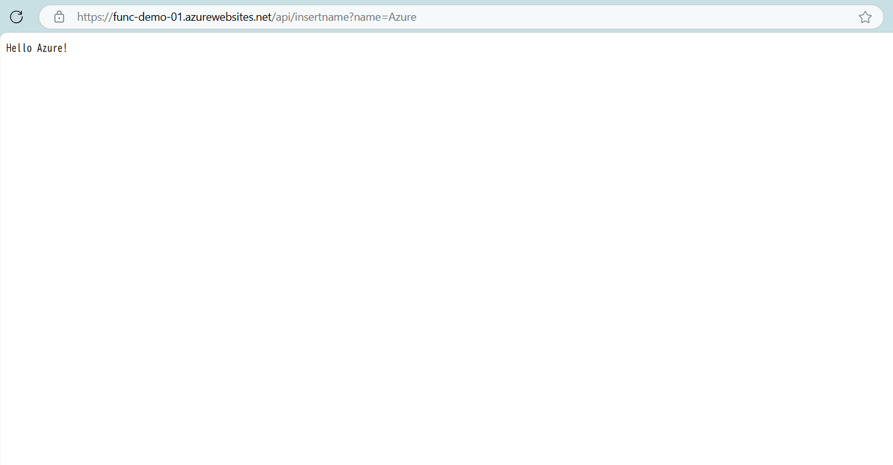

# 関数アプリの作成と展開
### Task 0: Git の準備

- 本リポジトリのクローン
- Azure Account
- Python 3.11 が利用可能な環境
- [Visual Studio Code](https://code.visualstudio.com/download)
- [Azure Function core tool](https://learn.microsoft.com/ja-jp/azure/azure-functions/functions-run-local?tabs=windows%2Cisolated-process%2Cnode-v4%2Cpython-v2%2Chttp-trigger%2Ccontainer-apps&pivots=programming-language-python)

### Task 1: Azure SQL の作成

- Azure ポータルの検索窓から **Azure SQL** と検索しAzure SQLをクリック

  

- [作成]を選択

  

- [SQL データベース] で、 [リソースの種類] を [単一データベース] に設定し、 [作成] を選択

  

- サブスクリプションを選択し、リソースグループを作成
- ワークロード環境には、この演習の [開発] を指定
- [サーバー] で、 [新規作成] を選択

  

- 認証方法は **SQL 認証を使用する** を選択
- ※サーバー名は、サブスクリプション内で一意ではなく、Azure のすべてのサーバーに対してグローバルに一意にする必要がある

  

- [ネットワーク] タブの [接続方法] で、 [パブリック エンドポイント] を選択

  

- [追加設定] タブにある [データ ソース] セクションの [既存のデータを使用します] で、 [サンプル] を選択
- サンプル データセット AdventureWorksLT を作成可能

  

- [作成]を選択

  

- 作成が完了したら[リソースに移動]を選択

  

- 左のメニューから[クエリ エディター]を選択してログイン

  

- サンプルデータを作成した場合は以下のクエリを実行

```sql
SELECT TOP 20 pc.Name as CategoryName, p.name as ProductName
FROM SalesLT.ProductCategory pc
JOIN SalesLT.Product p
ON pc.productcategoryid = p.productcategoryid;
```

  


- テーブルを作成する
```sql
CREATE TABLE dbo.ToDo (
    [Id] UNIQUEIDENTIFIER PRIMARY KEY,
    [order] INT NULL,
    [title] NVARCHAR(200) NOT NULL,
    [url] NVARCHAR(200) NOT NULL,
    [completed] BIT NOT NULL
);
```

### Task 2: 関数アプリの作成

- Azure ポータルの検索窓から **関数アプリ** と検索し関数アプリをクリック
- **関数アプリ** の **作成** をクリック
- 関数アプリの作成

  

- 関数アプリ名を設定、ランタイム スタックは Python、バージョンは 3.11 を選択
  

- **作成** をクリック
  

<br />

### Task 3: Visual Studio Code からのデプロイ

- **Terminal** - **New Terminal** を選択し、ターミナルを表示

  

- az login コマンドを実行

  ```
  az login
  ```

  Web ブラウザーが起動、サインイン画面が表示されるのでサインインを実行

  ※ サインイン後はブラウザを閉じる

- プロジェクト ファイルのディレクトリへ移動

  ```
  func azure functionapp publish <作成した関数アプリ名> --python
  ```

  - デプロイが正常に終了したことを確認

    

  <br />

### Task 4: 関数アプリの構成

- Azure Portal から Azure SQL Server のページを開き、[セキュリティ] で [ネットワーク] を選択します。 [Azure サービスとリソースにこのサーバーへのアクセスを許可する] の例外を確認

    

- Azure Portal から Azure SQL のページを開き、[設定] の [接続文字列] を選択する
- SQL 認証用の ADO.NET 接続文字列をコピー

    

- 接続文字列を追加

    

<br />

### Task 5: 関数アプリの実行

- Web ブラウザーを起動、アドレス バーに関数アプリの展開時に出力された URL を貼り付け

- ?name=xx (任意の名前) を付与して実行

  

- データベースに接続して、dbo.ToDo テーブルを右クリックし、[上位 1000 行を選択] をクリックして確認

<br />

